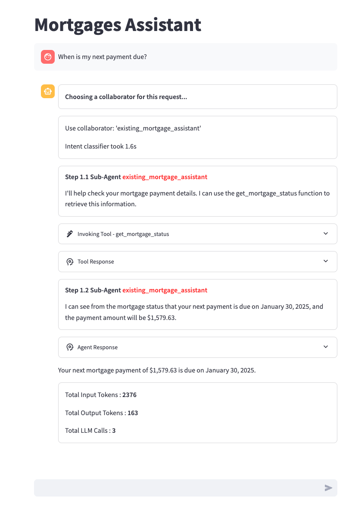

# Bedrock Agent Streamlit UI

A comprehensive Streamlit-based user interface for interacting with Amazon Bedrock Agents. This application provides a flexible, user-friendly interface that can be used with any text-based Bedrock agent across multiple AWS regions.



## Features

- **Intuitive Chat Interface**: Clean, user-friendly interface for interacting with Bedrock Agents
- **Multi-Agent Support**: Configure and use multiple agents through a simple configuration file
- **Multi-Region Support**: Work with agents deployed across different AWS regions
- **Custom Agent Configuration**: Connect to any Bedrock Agent by providing the necessary identifiers
- **Bilingual Interface**: Support for both English and Chinese languages
- **Agent Execution Visualization**: See the agent's reasoning process, tool usage, and knowledge base lookups
- **Token Usage Tracking**: Monitor token consumption for each conversation
- **Error Handling**: Robust error handling with user-friendly error messages
- **Session Management**: Create new chat sessions with a single click to start fresh conversations
- **In-App Agent Management**: Add and delete agents directly from the UI without editing configuration files
- **Prioritized New Agents**: Newly added agents appear at the top of the selection list for easy access
- **Enhanced Configuration Validation**: Automatic validation and retrieval of agent IDs and alias IDs

## Project Structure

- `demo_ui.py`: Main application file containing the Streamlit UI and application logic
- `ui_utils.py`: Utility functions for UI components and agent invocation
- `config.py`: Configuration file for preset agent definitions
- `src/utils/`: Helper functions for interacting with Bedrock Agents
- `docs/`: Documentation including architecture and design details

## Getting Started

### Prerequisites

- Python 3.x
- AWS account with access to Amazon Bedrock and Bedrock Agents
- AWS credentials configured with appropriate permissions
- Bedrock Agents created and deployed in your AWS account

### Installation

1. Clone the repository:

   ```bash
   git clone <repository-url>
   cd bedrock-agent-streamlit-ui
   ```

2. Create and activate a Python virtual environment:

   ```bash
   python3 -m venv .venv
   source .venv/bin/activate  # On Windows: .venv\Scripts\activate
   ```

3. Install required dependencies:

   ```bash
   pip install -r requirements.txt
   ```

### Using UV (Alternative Installation)

```bash
# 1. Create a UV virtual environment (defaults to .venv)
uv venv

# 2. Activate the virtual environment
source .venv/bin/activate  # On Windows: .venv\Scripts\activate

# 3. Install dependencies
uv pip install -r requirements.txt
```

## Running the Application

1. Configure your AWS credentials:

   ```bash
   export AWS_PROFILE=your-profile  # Or configure using AWS CLI
   ```

2. Run the Streamlit application:

   ```bash
   streamlit run demo_ui.py
   ```

3. Optionally, specify a specific bot using the BOT_NAME environment variable:

   ```bash
   BOT_NAME="Your Bot Name" streamlit run demo_ui.py
   ```

## Using the Application

### Selecting an Agent

1. Use the sidebar to select from preset agents or configure a custom agent
2. For preset agents, select from the dropdown and click "Apply"
3. For custom agents, toggle "Use Custom Configuration" and provide:
   - AWS Region
   - Agent Alias ID, Agent Name, or Agent ID
   - Click "Apply" to connect to the agent

### Interacting with Agents

1. Type your query in the chat input field at the bottom of the screen
2. The agent will process your request and display its response
3. You can view the agent's reasoning process by expanding the trace sections
4. Continue the conversation by entering additional queries

### Managing Chat Sessions

1. To start a new conversation while keeping the same agent, click the "New Session" button in the top-right corner of the chat area
2. This will clear the chat history and create a new session ID, allowing you to start a fresh conversation
3. The agent configuration remains the same, so you don't need to reconfigure the agent

### Adding and Removing Agents

#### Adding a New Agent

1. In the sidebar, expand the "Add New Bot" section
2. Fill in the required fields:
   - Bot Name: A display name for the agent in the UI
   - Agent Name: The name of your Bedrock agent
3. Optionally, you can also provide:
   - Agent Alias ID: If you know the specific alias ID you want to use
   - Start Prompt: An initial message to show users
   - Region: The AWS region where your agent is deployed
4. Click "Add" to add the agent to the list
5. The new agent will appear at the top of the selection list
6. Select the newly added agent and click "Apply" to use it

#### Removing an Agent

1. In the sidebar, expand the "Delete Bot" section
2. Select the agent you want to delete from the dropdown
3. Click "Delete" to remove the agent from the list

### Switching Languages

Use the language toggle at the bottom of the sidebar to switch between English and Chinese interfaces.

## Configuring Your Own Agents

You can add agents directly through the UI as described above, or by editing the configuration file:

1. Add a new configuration to the `bot_configs` list in `config.py`:

```python
{
    "bot_name": "Your Bot Name",    # Display name in the UI
    "agent_name": "your_agent_name",  # Your Bedrock agent name
    "region": "us-east-1",          # AWS region where your agent is deployed
    "start_prompt": "Initial message to show users",
    "session_attributes": {         # Optional: Include if your agent needs specific session attributes
        "sessionAttributes": {      # Custom key-value pairs for your agent's session
            "key1": "value1",
            "key2": "value2"
        },
        "promptSessionAttributes": {} # Additional prompt-specific attributes if needed
    }
}
```

2. Restart the application to load the new configuration

Note: Agents added through the UI will be saved to the `config.py` file automatically.

### Setting a Default Agent

To change the default agent:

1. Open `demo_ui.py` and locate the following line (around line 97):

```python
bot_name = os.environ.get('BOT_NAME', "Multi-agent PortfolioCreator")
```

2. Change `"Multi-agent PortfolioCreator"` to your preferred default agent name
3. Save the file and restart the application

## Configuration Priority

When configuring a custom agent, the application uses the following priority order to resolve agent information:

1. Agent Alias ID (highest priority)
2. Agent ID
3. Agent Name (lowest priority)

For example, if you provide an Agent Alias ID, the application will use it to look up the corresponding Agent ID and Agent Name. If you provide only an Agent Name, the application will look up the corresponding Agent ID and then the latest Agent Alias ID.

## Architecture and Design

For detailed information about the application's architecture and design, see:

- [Architecture Documentation](docs/architecture.md)
- [Design Documentation](docs/design.md)

## Error Handling and Configuration Validation

The application includes several error handling and configuration validation improvements:

1. **Multi-region support**: Handles agents located in different AWS regions
2. **Safe token handling**: Works correctly even if token values don't exist or are zero
3. **Function name handling**: Handles missing function keys in action group calls
4. **Exception catching**: Catches and logs exceptions with user-friendly error messages
5. **Path optimization**: Uses simplified import paths
6. **Automatic ID resolution**: Automatically resolves agent IDs and alias IDs based on available information
7. **Configuration validation**: Validates agent configurations before applying them to ensure they contain all required information
8. **Graceful error recovery**: Provides clear error messages and recovery options when configuration issues are detected
9. **Session management**: Properly handles session state to prevent data loss and ensure consistent behavior

## Tested Demo Examples

The following demos have been tested with this UI:

- **Sports Team Poet**: Creates poems about sports teams
- **Portfolio Assistant**: Analyzes stock tickers
- **Trip Planner**: Generates travel itineraries
- **Voyage Virtuoso**: Provides exotic travel recommendations
- **Mortgages Assistant**: Handles mortgage-related queries
- **Custom Orchestration**: Demonstrates ReWoo orchestration for a restaurant assistant agent

## Contributing

Contributions to improve the Bedrock Agent Streamlit UI are welcome. Please feel free to submit issues or pull requests.

## License

This project is licensed under the terms specified in the LICENSE file.
